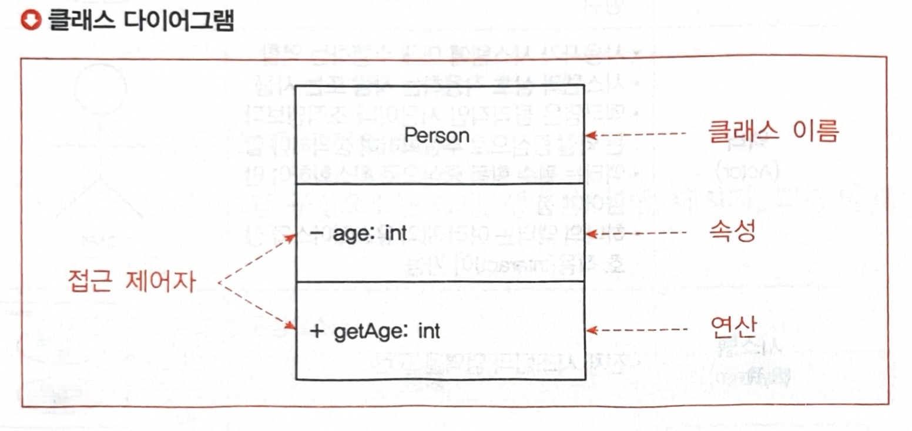
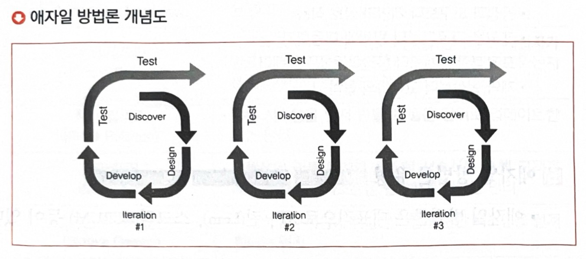

# 정보처리기사 필기

## 1. 소프트웨어 설계

### ch.01 요구사항 확인

####  (1) 현행 시스템 분석

##### 플랫폼 기능 분석
1. 플랫폼(Platform)의 개념
    - 플랫폼은 애플리케이션을 구동시키는데 필요한 소프트웨어의 환경이다
    - 동일 플랫폼 내에서는 상호 호환이 가능하도록 만들어진 결합체를 의미하낟.
    - 공급자와 수요자 등 복수 그룹이 참여하여 각 그룹이 얻고자 하는 가치를 공정한 거래를 통해 교환할 수 있도록 구축된 한경이다.
    - 예) 안드로이드 마켓, 페이스북, 인스타그램 등
            
2. 플랫폼 성능 특성 분석
    - 플랫폼 성능 분석을 통해 사용자의 서비스 이용 시 속도의 적정성을 알 수 있다.
    - 사용자 요구사항 중 성능에 대한 개선요청 항목은 현재 시스템 플랫폼 성능이 느린 것으로 제기될 가능성이 높다
        
3. 플랫폼 성능 특성 측정 항목
    - 플랫폼 성능 특성을 측정하는 항목에는 경과 시간, 사용률, 응당시간, 가용성 등이 있다.

    | 측정항목 | <center>설명<center> |
    |:-----:|-------|
    | 경과시간(Turnaround Timd) | - 애플리케이션에 작업을 의뢰(요구)한 시간부터 처리가 완료될 때까지 걸린 시간 |
    | 사용률(Utilization) | - 애플리케이션이 의뢰한 작업을 처리하는 동안 CPU, 메모리 등의 자원 사용률 
    | 응답시간(Response Time) | - 애플리케이션에 요청을 전달한 시간부터 응답이 도착할 때까지 걸린 시간 |
    | 가용성(Avaliability) | - 서버와 네트워크, 프로그램 등의 정보 시스테이 정상적으로 사용 가능한 용도 |

##### 운영체제 분석
1. 운영체제(OS: Operating System)의 개념
    - 운영체제는 하드웨어 및 소프트웨어 자원을 효울적으로 관리하며 공통된 기능을 제공하는 소프트웨어이다.
    - 사용자가 컴퓨터를 쉽게 사용하기 위해 지원하는 소프트웨어이다.
    - 예) 윈도우, 리눅스, 유닉스

2. 운영체제 현행 시스템 분석

    | 관점 | 고려 사항 | <center>설명<center> |
    | :------: | :-------: | --------- |
    | 품질측면 | 신뢰도 | - 장기간 시스템 운영 시 운영체제의 장애 발생 가능성 <br> - 운영체제의 버그로 인한 재기동 여부 |
    |  | 성능 | - 대규모 및 대량 파일 작업(**배치작업**) 처리 <br> - 지원 가능한 메모리 크기(32bit, 64bit) |
    | 지원 측면 | 기술 지원 | - 공급사들의 안정적인 기술 지원 <br> - 오픈 소스 여부 |
    |  | 주변 기기 | - 설치 가능한 하드 웨어 <br> - 다수의 주변 기기 지원 여부 |
    |  | 구축 비용 | - 지원 가능한 하드웨어 비용 <br> - 설치할 응용 ㅍ로그램의 라이선스 정책 및 비용 <br> - 유지 및 관리 비용 |

##### 네트워크 분석
1. 네트워크(Network)의 개념
    - 네트워크는 컴퓨터 장치들이 노드 간 연결 (데이터 링크)을 사용하여 서로에게 모이게 데이터를 교환하는 기술이다.
2. 네트워크 현행 시스템 분석
    - 현행 시스템에 구성된 네트워크 구조를 네트우크 구성도를 통해 분석한다.
    - 네트워크 구성도를 작성하여 서버 위치, 서버 간 연결 방식을 파악할 수 있다.
    - 네트워크 장애 발생 추적 및 대응 등의 다양한 용도로 활용할 수 있다.

##### DBMS 분석
1. DBMS(Database Management System)의 개념
    - DBMS는 데이터베이스라는 데이터의 집합을 만들고, 저장 및 관리할 수 있는 기능들을 제공한ㄴ 응용 프로그램이다.
    - DBMS 현행 시스템 분석 시 고려사항

    | 관점 | 고려사항 | <center>설명<center> |
    | :------: | :--------: | ---------|
    | 성능 측면 | 가용성 | - 장기간 시스템을 운영할 때 장애 발생 가능성 <br> - 백업 및 복구 편의성 <br> - DBMS 이중화 및 복제 지원 | 
    |  | 성능 | - 대규모 데이터 처리 성능 <br> - 대량 거래 처리 성능 <br> - 당양한 튜닝 옵션 지원 여부 <br> - 비용 기반 최적화 지원 및 설정의 최소화 |
    |  | 상호 호환성 | - 설치 가능한 운영체제 종류 <br> - 다양한 운영체제에서 지원되는 **JDBC, ODBC** |
    | 지원 측면 | 기술 지원 | - 공급 업체들의 안정적인 기술 지원 <br> - 다수의 사용자 간의 정보 공유 |
    || 구축 비용 | 라이선스 정책 및 비용 <br> - 유지 및 관리 비용 |


#### (2) 요구사항 확인

##### 요구 분석 기법
1. 요구 분석(Requirements Analysis)의 개념
    - 요구 분석은 사용자의 요구를 추출하여 목표를 정하고 어떤 방식으로 해결할 것인지 결정하는 단계이다.
    - 요구 분석은 개발 대상에 대한 사용자의 요구사항 중 명확하지 않거나 모호하여 이해되지 않는 부분을 발견하고 이를 걸러내기 위한 과정이다.

2. 요구 분석의 특징
    - 요구분석은 소프트웨어 개발의 실제적인 첫 단계로 사용자의 요구에 대해 이해하는 단계이다.
    - 분석 결과의 문서화를 통해 향후 유지보수에 유용하게 활용할 수 있다.
    - 보다 구체적인 명세를 위해 **소단위 명세서**가 활용될 수 있다.
    - 개발 비용이 가장 많이 소요되는 단계는 아니다
    - 요구분석 중 도메인(Domain) 분석은 요구에 대한 정보를 수집하고 배경을 분석하여 이를 토대로 모델링을 하게 된다.

3. 요구사항 분석 단계 절차
    | 순서 | 절차 | <center>설명<center> |
    | :-------: | :-------: | :--------- |
    | 1 | 요구사항 분류 | - 요구사항 유형(기능 / 비기능 요구사항) 확인하는 단계 <br> - 요구사항이 소프트웨어에 미치는 영향의 범위를 파악<br> - 요구사항이 소프트웨어 생명주기 동안 변경이 발생하는지를 확인 |
    | 2 | 개념 모델링 생성 및 분석 | - 모델: 요구사항을 더 쉽게 이해할 수 있도록 현실 세계의 상황을 단순화, 개념적으로 표현한 것<br> - 모델링: 모델을 만드는 단계<br> - 객체 모델, 데이터 모델, 상태 모델 등 다양한 모델 작성 가능<br> - 모델링 표기를 위해 DFD(Data Flow Diagram), 자료 사전(DD), UML 다이어그램, E-R 다이어그램 사용 |
    | 3 | 요구사항 할당 | - 요구사항을 만족시키기 위한 아키텍처 구성요소를 식별하는 단계<br> - 다른 구성요소와 어떻게 상호 작용하는지 분석을 통해 추가적인 요구사항을 발견 가능 |
    | 4 | 요구사항 협상 | - 두 명의 이해관계자가 서로 상충되는 내용을 요구하는 경우, 어느 한쪽을 지지하기보다는 적절한 지점에서 합의하기 위한 단계<br> - 요구사항이 서로 충돌되는 경우 각각 우선순위를 부여하면 무엇이 더 중요한지를 인식할 수 있으므로 문제 해결에 도움이 됨 |
    | 5 | 정형 분석 | - 형식적으로 정의된 의미를 지닌 언어로 요구사항을 표현하는 단계<br> - 구문(Syntax)와 의미(Semantics)를 갖는 정형화된 언어를 사용하여 수학적 기호로 표현<br> - 요구사항 분석의 마지막 단계에서 이루어짐 |

4. 요구사항 분석 기술 

    | 분석 기술 | <center>설명<center> |
    |:---------: | ------------ |
    | 청취 기술 | - 이해관계자로부터 의견을 듣는 기술 |
    | 인터뷰와 질문 기술 | - 이해관계자를 만나 정보를 수집하고 이야기를 나누는 기술 |
    | 분석 기술 | - 추출된 요구사항에 대해 충돌, 중복, 누락 등의 분석을 통해 완전성과 일관성을 확보하는 기술 |
    | 중재 기술 | - 이해관계자들의 상반된 요구에 대한 중재 기술 |
    | 관찰 기술 | - 사용자가 작업하는 것을 관찰하면서 사용자가 언급하지 않은 미묘한 의미를 탐지할 수 있는 기술 |
    | 작성 기술 | - 요구사항 분석서 등의 문서 작성 기술 |
    | 조직 기술 | - 수집된 방대한 정보를 일관성 있는 정보로 구조화하는 능력 |
    | 모델 작성 기술 | - 수집한 자료를 바탕으로 제어의 흐름, 기능 처리, 동작 행위, 정보 내용 등을 이해하기 쉽도록 모델로 작성하는 기술 |

5. 요구사항 분석에 사용하는 기능 모델링 기법
    - 데이터 흐름도(DFD Data Flow Diagram)
    1) 개념
        - 데이터 흐름도는 데이터가 각 프로세스를 따라 흐르면서 변환되는 모습을 나타낸 그림이다.
        - 시스템 분석과 설계에서 매우 유용하게 사용되는 다이어그램이다.
        - 데이터 흐름도는 시스템의 모델링 도구로서 가장 보푠적으로 사용되는 것 중의 하나이다.
        - 자료 흐름 그래프 또는 버블(Bubble) 차트라고도 한다.
    2) 특징
        - 구조적 분석 기법에 이용된다.
        - 데이터의 흐름에 중심을 두는 분석용 도구이다.
        - 제어(Control)의 흐름은 중요하지 않다.
        - 시간 흐름을 명확하게 표현할 수는 없다.
    3) 구성요소

        | 구성요소 | 설<center>설명<center>명 | 표기 |
        | :--------: | --------- | :----------: |
        | 처리기(Process) | - 입력된 데이터를 원하는 형태로 변환하여 출력하기 위한 요소<br> - 처리, 기능, 변환, 버블으로도 불림 | 원 |
        | 데이터 흐름(Data Flow) | - DFD의 구성요소(프로세스, 에이터 저장소, 외부 엔터티)들 간의 주고받는 데이터 흐름을 나타내는 요소<br> - 화살표 위에 자료의 이름을 기입 | 화살표 |
        | 데이터 저장소(Data Store) | - 데이터가 저장된 장소를 나타내는 요소<br> - 평행선 안에는 데이터 저장소의 이름을 넣음 | 평행선 |
        | 단말(Terminator) | - 프로세스 처리 과정에서 데이터가 발생하는 시작과 종료를 나타내는 요소<br> - 시스템과 교신하는 외부 개체<br> - 사각형 안에는 외부 엔터티의 이름을 넣음 | 사각형 |

    - 자료 사전(DD: Data Dictionary)
    1) 개념
        - 자료 사전은 자료 요소, 자료 요소들의 집합, 자료의 흐름, 자료 저장소의 의미와 그들 간의 관계, 관계 값, 범위, 단위들을 구체적으로 명시하는 사전이다.
        - 자료 사전은 파일 혹은 데이터베이스에 있는 자료에 대한 자료 또는 각 자료 항목에 주어진 이름과 길이 그리고 서술과 같은 데이터를 포함하는 참조를 위한 작업이다.
    2) 작성 목적
        - 자료 사전은 조직에 속해 있는 다른 사람들에게 특정한 자료 용어가 무엇을 의미하는지를 알려주기 위하여, 용어의 정의를 조정하고 취합하고 문서를 명확히 하는 목적이 있다.
        - 자료 흐름도에 나타나는 어떤 자료도 자료 사전에 정의되어 있어야 한다.
    3) 기호

        | 기호 | <center>설명<center> |
        | :--------: | ---------- |
        | = | - 자료의 정으로서 '~으로 구성되어(is Composed of)있다'는 것을 나타내는 기호<br> - 정의는 주석을 사용하여 의미를 기술하며, 자료 흐름과 자료 저장소에 대한 구성 내역을 설명하고, 자료 원소에 대항 값이나 단위를 나타내는 기호 |
        | + | - 자료의 연결(and, along with)을 나타내는 기호 |
        | () | - 자료의 생략 가능함을 나타내는 기호 |
        | {} | - 자료의 반복을 나타내는 기호<br> - 반복 횟수를 기록하는데 {}에서 좌측에는 최초 반복 횟수를 기록하고, 우측에는 최대 반복 횟수를 기록<br> - 반복 횟수를 기록하지 않을 때는 기본값으로 최소는 0, 최대는 무한대를 나타냄 |
        | [] | - 자료의 선택을 나타내는 기호<br> - 택일 기호 [\|]는 '\|'로 분리된 항목 중 하나가 선택된다는 것을 표시 |
        | ** | - 자료의 설명을 나타내는 기호<br> - 주석(Comment) |
    4) 작성원칙
        
        | 작성원칙 | <center>설명<center> |
        | :--------: | ---------------|
        | 자료의 의미 기술 | - 자료의 의미는 주석을 통해서 기술 <br> - 자료의 의미를 기술할 때는 그 자료가 대상 시스템에서 사용되는 적합한 뜻을 표현해야 함 <br> - 중복되는 기술을 회피 |
        | 자료 구성항목의 기술 | - 구성 항목들을 그룹으로 묶음 <br> - 각 그룹에 대하여 의미 있는 이름을 부여 <br> - 이름이 붙여진 각 그룹을 다시 정의 |
        | 동의어 규정 준수 | - 사용자들의 용어를 통일시키는 것보다는 사용하는 용어를 이용하여 자료를 정의하는 것이 간단함 |
        | 자료 정의의 중복 제거 | - 같은 자료에 대해 여러 명의 분석가가 독립적으로 분석을 시행한다면, 서로 다른 이름을 사용할 수 있으므로 자료 정의의 중복 제거 필요 |

6. 요구 사항 분석이 어려운 이유
    - 개발자와 사용자 간의 지식이나 표현의 차이가 커서 상호 이해가 쉽지 않다.
    - 사용자의 요구사항이 모호하고 불명확하다.
    - 소프트웨어 개발 과정 중에 요구사항이 계속 변할 수 있다.
    - 사용자의 요구는 예외가 많아 열거와 구조화가 어려운 편이다.

##### UML(Unified Modeling Language)
1. 개념
    - UML은 객체 지향 소프트웨어 개발 과정에서 산출물을 명세화, 시각화, 문서화할 때 사용되는 모델링 기술과 방법론을 통합해서 만든 표준화된 범용 모델링 언어이다.

2. 특징
    - UML은 방법론을 통합한 것으로, 표준화된 모델링 기법을 제공한다.

    | 특징 | <center>설명<center> |
    | :--------: | ----------------|
    | 가시화 언어 | - 개념 모델 작성 시 오류가 적고 의사소통이 용이 |
    | 구축언어 | - 다양한 프로그래밍 언어로 실행 시스템의 예측 가능 <br> - UML을 소스 코드로 변환하여 구축 가능, 역 변환하여 역공학 가능 |
    | 명세화 언어 | - 정확한 모델 제시, 완전한 모델 작성 가능 |
    | 문서화 언어 | - 시스템에 대한 평가 및 의사소통의 문서 |

3. 구성 요소
    | 구성 요소 | <center>설명<center> |
    | :--------: | ------------------------ |
    | 사물(Things) | - 추상적인 개념으로, 주제를 나타내는 요소 <br> - 단어 관점에서 '명사' 혹은 '동사'를 의미 |
    | 관계(Relationships) | - 사물의 의미를 확장하고 명확히 하는 요소 <br> - 사물과 사물ㅇㄹ 연결하여 관계를 표현하는 요소 <br> - 단어 관점에서 '형용사' 혹은 '부사'를 의미 |
    | 다이어그램(Diagram) | - 사물과 관계를 모아 그림으로 표현한 형태 <br> - 형식과 목적에 따라 9가지로 정의 |

4. UML 사물
    | 종류 | <center>설명<center> |
    | :-------: | --------------|
    | 구조 사물 <br>(Structural Things) | - UML 모델의 정적인 부분들을 정의 <br> - 시스템의 물리적, 개념적 요소들을 표현 <br> `예) 클래스, 유스케이스, 컴포넌트, 노드 등` |
    | 행동 사물<br>(Behavioral Things) | -UML 모델의 동적인 부분을 표현 <br> - 시간과 공간에 따른 요소들의 행위를 표현 <br> `예) 상호 작용, 상태 머신 등` |
    | 그룹 사물 <br> (Grouping Things) | -UML 모델의 요소들을 그룹으로 묶어서 표현 <br> `예) 패키지 등` |
    | 추해 사물 <br> (Annotational Things) | - UML 모델을 설명(주석) <br> - 부가적인 설명이나 제약조건 등을 표현 <br> `예) 노트 등` |

5. UML 다이어그램(UML Diagram)
    - 개념: UML 다이어그램은 사물과 관계를 모아 그림으로 효현한 형태이다.
    - 구분

    | 구분 | 다이어그램 | <center>설명<center> |
    | :---------: | :----------: | -------------- |
    | 구조적(Structural) / 정적(Static) 다이어그램 | 클래스(Class) | - 시스템 내 클래스의 정적 구조를 표현 <br> - 속성(Atrribute)과 동작(Behavior)으로 구성 <br> - 시스템의 구조를 파악하고 구조상의 문제점 도출 가능 <br> - 클래스와 클래스, 클래스의 속성 사이의 관계를 포함 |
    | | 객체(Object) | - 클래스에 속한 사물(객체)들, 즉 인스턴스(Instance)를 특정 시점의 객체와 객체 사이의 관계로 표현 <br> - 객체를 사용하여 실제 클래스를 나타냄 <br> - 연관된 모든 인스턴스를 표현 | 
    || 컴포넌트(Component) | - 코드 컴포넌트 기반의 물리적 구조 표현 <br> - 실질적 프로그래밍 작업에 사용 |
    || 배치(Deployment) | - 컴포넌트 사이의 종속성을 표현 <br> - 결과물, 프로세스, 컴포넌트 등 물리적 요소들의 위치를 표현 |
    || 복합체 구조(Composile Structure) | - 클래스나 컴포넌트가 복합 구조를 갖는 경우 그 내부 구조를 표현 |
    || 패키지(Package) | - 유스케이스나 클래스 등의 모델 요소들을 그룹화한 캐키지들의 관계를 표현 |
    | 행위적(Behavioral) / 동적(Dynamic) 다이어그램 | 유스케이스(Usecase) | - 사용자 관점에서 시스템의 활동을 표현 <br> - 유스케이스는 시스템의 기능적 요구 정의에 활용 |
    || 시퀸스(Sequence) | - 객체 간 상호 작용을 메시지 흐름으로 표현 <br> - 객체 사이 메시지를 보내는 시간을 표현 <br> - 교류(Interaction) 다이어그램의 한 종류로 볼 수 있음 |
    || 커뮤니케이션(Communication) | - 시퀸스 다이어글매과 같이 동작에 참여하는 객체들이 주고받는 메시지를 표현하는데, 메시지뿐만 아니라 객체 간의 연관까지 표현 |
    || 상태(State)| - 하나의 객체가 자신이 속한 클래스의 상탠 변화 혹은 다른 객체와의 상호 작용에 따라 상태가 어떻게 변화하는지 표현 <br> - 모든 가능한 상태와 전이를 표현 <br> - 진입 조건, 탈출 조건, 상태 전이 등 기술 |
    || 활동(Activity) | - 시스템이 어떤 기능을 수행하는지를 객체의 처리 로직이나 조건에 따른 처리의 흐름으로 순서대로 표현 <br> - 활동의 순서대로 흐름을 표현 | 
    || 타이밍(Timing) | - 객체 상태 변화와 시간 제약을 명시적으로 표현 |

6. UML 상세
    - 클래스 다이어그램(Class Diagram)
        - 개념
            - 클래스 다이어그램은 객체 지향 모델링 시 클래스의 속성 및 연산과 클래스 간 정적인 관계를 표현한 다이어그램이다.
            - 클래스 간의 관계와 클래스의 속성을 표현한다.
        - 구성 요소

        | 구성요소 | <center>설명<center>|
        | :---------: | -------------|
        | 클래스 이름(Class Name) | - 클래스의 이름 |
        | 속성(Attribute) | - 클래스의 특징에 이름을 부여 |
        | 연산(Operation) | -클래스에 속하는 객체에 적용될 메서드를 정의 <br> - 클래스의 동작을 의미하며, UML에서는 동작에 대한 인터페이스를 지칭 |
        | 접근 제어자(Access Modifier) | - 클래스에 접근할 수 있는 정도를 표현 <br> `'-' : 클래스 내부 접근만 허용(Private)` <br>  `'+' : 클래스 외부 접근을 허용(Public)` <br>  `'#' : 동일 패키지, 파생 클래스에서 접근 가능(Protected)` <br>  `'~' : 동일 패키지 클래스에서 접근 가능(default)` |

        

    - 유스케이스 다이어그램(Usecase Diagram)
        - 개념
            - 유스케이스 다이어그램은 시스템이 제공하는 기능 및 그와 관련된 외부 요소를 사용자의 관점에서 표현하는 다이어그램이다.
        - 구성요소

        | 구성요소 | <center>설명<center> |
        | :---------: | ---------------| 
        | 유스케이스(Usecase) | - 시스템이 제공해야 하는 서비스 <br> - 액터가 시스템을 통해 수행하는 일련의 행위 |
        | 액터(Actor) | -사용자가 시스템에 대해 수행하는 역할 <br> - 시스템과 상호 작용하는 사람 혹은 사물 <br> - 액터명은 물리적인 사람이나 조직명보다는 역할 중심ㅇ로 추상화하여 정의해야 함 <br> - 액터는 필수 항목 중심ㅇ로 최소화하여 만들어야 함 <br> - 하나의 액터는 여러 개의 유스케이스와 상호 작용(Interact)이 가능 | 
        | 시스템(System) | - 전체 시스템의 영역을 표현 |

        - 유스케이스 다이어그램 구성요소 간의 관계

        | 관계 | <center>설명<center> |
        | :---------: | ---------------|
        | 연관 관계(Association) | - 유스케이스와 액터 간의 상호 작용이 있음을 표현 <br> - 유스케이스와 액터를 실선으로 연결 |
        | 포함 관계(Include) | - 하나의 유스케이스가 다른 유스케이스의 실행을 전제로 할 때 형성되는 관계 <br> - 화살표를 점선으로 연결하고 <<include>>라고 표기 |
        | 확장 관계(Extend) | - 특정 조건에 다라 확장 기능 유스케이스를 수행하는 관계 |
        | 일반화 관계(Generalization) | - 유사한 유스케이스 또는 액터를 모아 추상화한 유스케이스 또는 액터와 연결해 그룹을 만들어 이해도를 높이기 위한 관계 |

    - 시퀸스 다이어그램(Sequence Diagram)
        - 개념
            - 시퀸스 다이어그램은 객체 간 상호 작용을 메시지 흐름으로 표현한 다이어그램이다.
        - 구성 요소

        | 구성요소 | <center>설명<center>|
        | :--------------: | ------------------ |
        | 객체(Object) | - 객체는 위쪽에 표시되며 아래로 생명선을 가짐 <br> - 객체는 사각형안에 밑줄 친 이름으로 명시 |
        | 생명선(Lifeline) | - 객체로부터 뻗어 나가는 점선 <br> - 실제 시간이 흐름에 따라 객체의 생명주기동안 발생하는 이벤트를 명시 |
        | 실행(Activation) | - 직사각형은 오퍼레이션(함수)이 실행되는 시간을 의미 <br> - 직사각형이 길어질수록 오퍼레이션 수행 시간이 긺 |
        |  메시지(Message) | - 객체 간의 상호 작용은 메시지 교환으로 이루어짐 <br> - 한 객체에서 다른 객체로의 메시지를 전달하여 전달받은 객체의 오퍼레이션을 수행 | 
        | 회귀 메시지(Self_Message) | - 같은 객체에 대한 함수(메서드)를 호출 <br> - 본인의 Lifeline으로 회귀하는 화살표로 표현 |

    - 상태 다이어그램(State Diagram)
        - 개념 
            - 상태 다이어그램은 하나의 객체가 자신이 속한 클래스의 상태 변화 혹은 다른 객체와의 상호 작용에 따라 상태가 어떻게 변화하는지 표현하는 다이어그램이다.
            - 상태 다이어그램은 어떤 이벤트에 의해 객체 자신이 속한 클래스의 상태 변화나 객체 간 상호 작용하는 과정에서 상태 변화를 표현한다.
        - 구성요소

        | 구성요소 | <center>상태<center> |
        | :----------: | ---------------------------|
        | 상태(state) | - 객체가 존재할 수 있는 조건 <br> - 둥근 사각형 안에 객체의 상태 기술 |
        | 시작 상태(Initial State) | - 객체의 시작 형태 <br> - 속이 채워진 원으로 표현 |
        | 종료 상태(Final State) | - 객체의 종료 상태 <br> - 원 안에 속이 채워진 워으로 표현 |
        | 전이(Transition) | - 객체의 상태가 다른 상태로 변경되는 상태 <br> - 화살표로 표현 |
        | 이벤트(Event) | - 상태의 변화를 주는 현상 <br> - 상태의 전이를 유발하는 이벤트는 전이 위에 이벤트 이름을 표시 <br> `예) 시간의 흐름, 조건, 외부 신호 등` |
        | 전이 조건(Transition Condition) | - 특정 조건 만족 시 전이가 발생하게 하도록 사용되는 속성값의 **불린 식** |

7. UML의 관계(Relationship)
    | 구분 | <center>설명<center> |
    |:------------: | --------------------|
    | 연관(Association)관계 | - 2개 이상의 사물이 서로 관련된 상태를 표현하는 관계 <br> - 사물 사이를 실선으로 연결하여 표현하며, 방향성은 화살표로 표현 <br> - 서로에게 영향을 주는 양방향 관계의 경우 화살표를 생략하고 실선으로만 연결 |
    | 의존(Dependency)관계 | -사물 사이에 서로 연관은 있으나 필요에 따라 서로에게 영향을 주는 짧은 시간 동안만 연관을 유지하는 관계를 표현하는 관계 <br> - 사물의 변화가 다른 사물에도 영향을 미치는 관계 <br> - 일반적으로 한 클래스가 다른 클래스를 오퍼레이션의 매개변수로 사용하는 경우에 나타나는 관계 <br> - 영향을 주는 사물이 영향을 받는 사물 쪽으로 점선 화살표로 연결하여 표현 |
    | 일반화(Generalizaion)관계 | - 하나의 사물이 다른 사물에 비해 더 일반적인지 구체적인지를 표현하는 관계 <br> - 일반적인 개념을 부모(상위)라고 하고, 구체적인 개념을 자식(하위)이라 함 <br> - 구체적(하위)인 사물에서 일반적(상위)인 사물 족으로 속이 빈 화살표를 연결하여 표현 |
    | 실체화(Realizaion)관계 | - 한 객체가 다른 객체에 오퍼레이션을 수행하도록 지정하는 관계를 표현하는 관계 <br> - 사물에서 기능 쪽으로 속이 빈 점선 화살표를 연결하여 표현 |
    | 포함(Composition)관계 | - 집합 관계의 특수한 형태로, 포함하는 사물의 변화가 포함되는 사물에 영향을 미치는 관계를 표현하는 관계 <br> - 포함되는 쪽(부분)에서 포함하는 쪽(전체)으로 속이 채워진 마름모를 연결하여 표현 |
    | 집합(Aggregation)관계 | - 하난의 사물이 다른 사물에 포함된 관계 <br> - 포함되는 쪽(부분)에서 포함하는 쪽(전체)으로 속이 빈 마름모를 연결하여 표현 |

8. UML 확장 모델의 스테레오 타입(Stereotype)
    - UML의 스테레오 타입은 UML의 기본적 요소 이외의 새로운 요소를 만들어 내기 위한 확장 메커니즘이다.
    - 형태는 기존 UML의 요소를 그대로 사용하지만, 내부 의미는 다른 목적으로 사용하도록 확장한다.
    - UML의 스트레오 타입은 '<< >>'(길러멧: Guillemet) 기호를 사용하여 표현한다.

    | 타입 | <center>설명<center> |
    | :-------------------: | --------------------------- |
    | <<include>> | -하나의 유스케이스가 어떤 시점에 반드시 다른 유스케이스를 실행하는 포함 관계 |
    | <<extend>> | - 하나의 유스케이스가 어떤 시점에 다른 유스케이스를 실행할 수도 있고, 그렇지 않을 수도 있는 확장 관계 <br> - 기본 유스케이스 수행 시 특별한 조건을 만족할 때 수행 | 
    | <<interface>> | - 모든 메서드가 추상 메서드이며, 바로 인스턴스를 만들 수 없는 클래스로 추상 메서드와 상수만으로 구성된 클래스 |

##### 애자일(Agile)
1. 애자일 방법론의 개념
    - 애자일 방법론은 소프트웨어 개발방법론의 하나로서 개발과 함께 즉시 피드백을 받아서 유동적으로 개발하는 방법이다.

    

2. 애자일 방법론 등장 배경
    | 등장 배경 | <center>설명<center> |
    | :-----------: | --------------------------|
    | 소프트웨어 개발 환경의 변화 | - 소프트웨어 개발 트랜드가 모바일 환경으로 변화 <br> - 시장 적시성과 잦은 배포의 중요성 부각 |
    | 기존 개발방법론의 한계 | - 전통적 방법론은 문서 및 절차 위주로 변화에 신속한 대응이 어려움 <br> - 빠르게 적용하고 효율적으로 개발할 수 있는 방법론의 필요성 증가 | 

3. 애자일 방법론 특징
    - 프로젝트의 요구사항은 기능 중심으로 정의한다.
    - 절차와 도구보다 개인과 소통을 중요하게 생각한다.
    - 작업 계획을 짧게 세워 요구 변화에 유연하고 신속하게 대응할 수 있다.
    - 소프트웨어가 잘 실행되는 데 가치를 둔다.
    - 고객과의 피드백을 중요하게 생각한다.

4. 애자일 선언문
    - 애자일 방법론을 실천하기 위한 주요 원칙
    ```
    - 공정과 도구보다 개인과 상호 작용
    - 계획을 따르기보다 변화에 대응하기
    - 포괄적인 문서보다 동작하는 소프트웨어
    - 계약 협상보다 고객과의 협력
    ```
    
5. 애자일 방법론 유형
    - XP(eXtreme Programming)
        - XP는 의사소통 개선과 즉각적 피드백으로 소프트웨어 품질을 높이기 위한 방법론이다.
        - 기존의 방법론에 비해 실용성을 강조한 방법론이다.
        - 1~3주기의 반복(Iteration) 개발 주기를 가지며, 5가지 가치와 12개의 실천 항목이 존재한다.
        - XP의 5가지 가치

        | 가치 | <center>설명<center> |
        | :--------------: | ------------------------|
        | 용기(Courage) | - 용기를 가지고 자신감 있게 개발 <br> - 코드를 작성하기 전에 테스트, 빠르게 피드백, 테스트에 부합하지 못하는 코드를 리팩토링할 수 있는 용기 |
        | 단순성(Simplicity) | - 필요한 것만 하고 그 이상의 것들은 하지 않음 |
        | 의사소통(Communication) | - 개발자, 관리자, 고개 간의 원할한 소통 |
        | 피드백(Feedback) | - 의사소통에 대한 빠른 피드백 |
        | 존중(Respect) | - 팀원 간의 상호 존중 |

        - XP의 12가지 기본 원리

        | 기본 원칙 | <center>설명<center> |
        | :-------------: | ------------------------------------ |
        | 짝 프로그래밍 <br> (Pair Programming) | - 개발자 둘이서 짝으로 코딩하는 원칙 | 
        | 공동 코드 소유 <br> (Collective Ownership) | - 시스템이 있는 코드는 누구든지 언제라도 수정 가능하다는 원리 |
        | 지속적인 통합 <br> (CI: Continuous Interation) | - 매일 여러 번씩 소프트웨어를 통합하고 빌드해야 한다는 원리 |
        | 계획세우기 <br> (Planning Process) | - 고객이 요구하는 비즈니스 가치를 정의하고, 개발자가 필요한 것은 무엇이며 어떤 부분에서 지연될 수 있는지를 알려주어야 한다는 원리 |
        | 작은 릴리즈 <br> (Small Release) | - 작은 시스템을 먼저 만들고, 짧은 단위로 업데이트한다는 원리 |
        | 메타포어 <br> (Metaphor) | - 공통적인 이름 체계와 시스템 서술서를 통해 고객과 개발자 간의 의사소통을 원할하게 한다는 원리 |
        | 간단한 디자인 <br> (Simple Design) | -현재의 요구사항에 적합한 가장 단순한 시스템을 설계한다는 원리 |
        | 테스트 기반 개발 <br> (TDD: Test Driven Development) | - 작성해야 하는 프로그램에 대한 텍스트를 먼저 수정하고 이 테스트를 통과할 수 있도록 실제 프로그램의 코드를 작성한다는 원리 |
        | 리팩토링 <br> (Refactoring) | - 프로그램의 기능을 바꾸지 않으면서 중복 제거, 단순화 등을 통해 코드의 내부 구조를 개선하고 재구성하는 원리 |
        | 40시간 작업 <br> (40-Hour Work) | - 개발자가 피곤을 인해 실수하지 않도록 일주일에 40시간 이상을 일하지 말아야 한다는 원리 |
        | 고객 상주 <br> (On Site Customer) | - 개발자들의 질문에 즉각 대답해 줄 수 있는 고객을 프로젝트에 풀 타임으로 상주시켜야 한다는 원리 |
        | 코드 표준 <br> (Coding Standard) | - 효과적인 공동 작업을 위해서는 모든 코드에 대한 코딩 표준을 정의해야 한다는 원리 |

    - 스크럼(SCRUM)
        - 스크럼은 매일 정해진 시간, 장소에서 짧은 시간의 개발을 하는 팀을 위한 프로젝트 관리 중심 방법론이다.
        - 스크럼의 주요 용어

        | 주요 용어 | <center> 설명 <center> |
        | :---------------: | ------------------------------ |
        | 제품 책임자 <br> (Product Owner) | - 이해관계자의 의견을 종합하여 제품에 대한 요구사항을 작성하는 주체 <br> - 주로 개발 의뢰자나 사용자가 담당 <br> - 이해관계자 중 개발될 제품에 대한 이해도가 높고, 요구사항을 책임지고 의사 결정할 사람으로 선정 |
        | 제품 백로그<br>(Product Backlog) | - 제품과 프로젝트에 대한 모든 요구사항 <br> - 스크럼 팀이 해결해야 하는 목록으로 소프트웨어 요구사항, 아키텍처 정의 등이 포함될 수 있음 |
        | 스프린트<br>(Sprint) | - 실제 개발 작업 기간 <br> - 2~4주의 짧은 개발 기간으로 되어 ㅇㅆ고, 반복적 수행으로 개발 품질을 향상 |
        | 스크럼 미팅<br>(Scrum Meeting) | - 매일 15분 정도 미팅으로 To-Do List 계획 수립 <br> - Daily Meeting이라고도 함 |
        | 스크럼 마스터<br>(Scrum Master) | - 프로젝트 리더, 스크럼 수행 시 문제를 인지 맟 해결하는 사람 <br>- 스크럼 프로세스를 따르고, 팀이 스크럼을 효과적으로 활용할 수 있도록 보장하는 역할 등을 맡음 |
        | 스프린트 회고<br>(Sprint Retrospective) | - 스프린트 주기를 되돌아보며 정해놓은 규칙 준수 여부, 개선점 등을 확인 및 기록 <br> - 해당 스프린트가 끝난 시점이나 일정 주기로 시행 |
        | 번 다운 차트<br>(Burn Down Chart) | - 남아있는 백로그 대비 시간을 그래픽적으로 표현한 차트 <br> - 백로그는 보통 수직축에 위치하며 시간은 수평축에 위치 |
        | 속도 <br>(Velocity) | - 한 번의 스프린트에서 한 팀이 어느 정도의 제품 백로그를 감당할 수 있는지에 대한 추정치 |

    - 린(Lean)
        - 린은 도요타의 린 시스템 품질 기법을 소프트웨어 개발 프로세스에 적용해서 낭비요소를 제가하여 품질을 향상시킨 방법론이다.
        - 린은 JIT(Just In Time), **칸반 보드**를 사용한다.

    - 크리스탈(Crystal)
        - 크리스탈은 일반적으로 프로세스나 도구보다는 사람에게 더 많은 중점을 두는 방법론이다.
        - 생명이 중요하지 않은 시스템에서 작업하는 최대 6명 또는 8명의 공동배치 소프트웨어 개발자 팀에 적용한다.
    
    - ASD(Adaptive Software Development)
        - ASD는 개발을 혼란 자체로 규정하고, 혼란을 대전제로 그에 적응할 수 있는 소프트웨어 방법으 ㄹ제시하기 위해 만들어진 방법론이다.
        - 합동 애플리케이션 개발(Joint Application Development)을 사용한다.

    - FDD(Feature Driven Development)
        - FDD는 프로젝트를 작은 기능 단위로 나누어 개발하고, 이를 통해 빠른 피드백과 지속적인 개선을 추구하는 방법론이다.


#### (3) 분석 모델 확인

### ch.02 화면 설계

#### UI 요구사항 확인

### ch.03 애플리케이션 셜계

#### (1) 공동 모듈 설계
#### (2) 객체 지향 설계

### ch.04 인터페이스 설계

#### (1) 인터페이스 요구사항 확인
#### (2) 인터페이스 대상 식별
#### (3) 인터페이스 상세 설계

## 2. 소프트웨어 개발

### ch.01 데이터 입출력 개발

#### (1) 논리 데이터 저장소 확인

### ch.02 통합 구현

#### (1) 모듈 구현
#### (2) 통합 구현 관리

### ch.03 제품 소프트웨어 패키징

#### (1) 제품 소프트웨어 패키징
#### (2) 제품 소프트웨어 매뉴얼 작성
#### (3) 제품 소프트웨어 버전 관리

### ch.04 애플리케이션 테스트 관리

#### (1) 애플리케이션 테스트 케이스 설계
#### (2) 애플리케이션 통합 테스트
#### (3) 애플리케이션 성능 개선

### ch.05 인터페이스 구현

#### (1) 인터페이스 설계 확인
#### (2) 인터페이스 기능 구현

## 3. 데이터베이스 구축

### ch.01 SQL 응용

#### (1) 절차형 SQL 작성
#### (2) 응용 SQL 작성

### ch.02 SQL 활용

#### (1) 기본 SQL 작성
#### (2 )고급 SQL 작성

### ch.03 논리 데이터베이스 설계

#### (1) 관계 데이터베이스 모델
#### (2) 데이터 모델링 및 설계

### ch.04 물리 데이터베이스 설계

#### (1) 물리 요소 조사 분석
#### (2) DB 물리 속성 설계
#### (3) 데이터베이스 무결성과 키
#### (4) DB 반 정규화